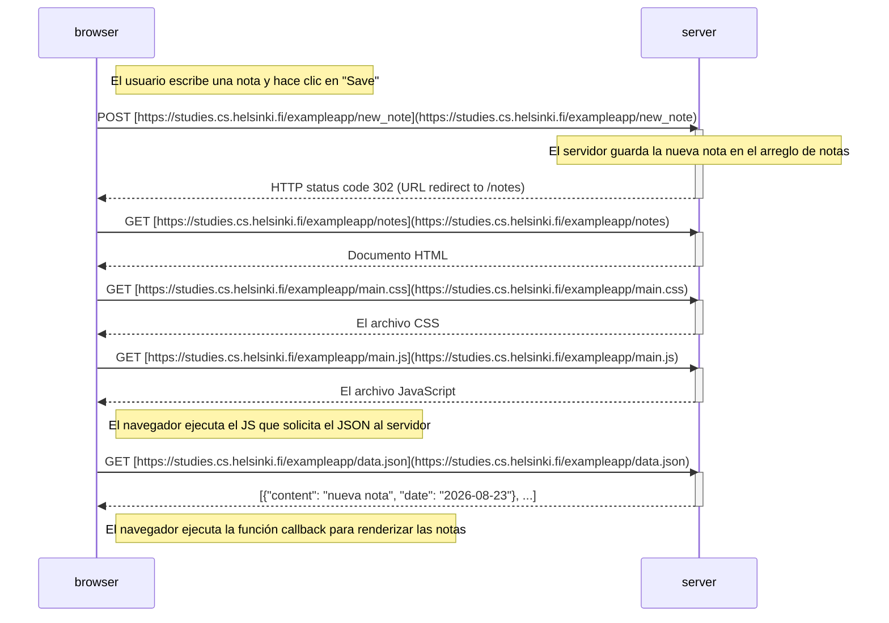
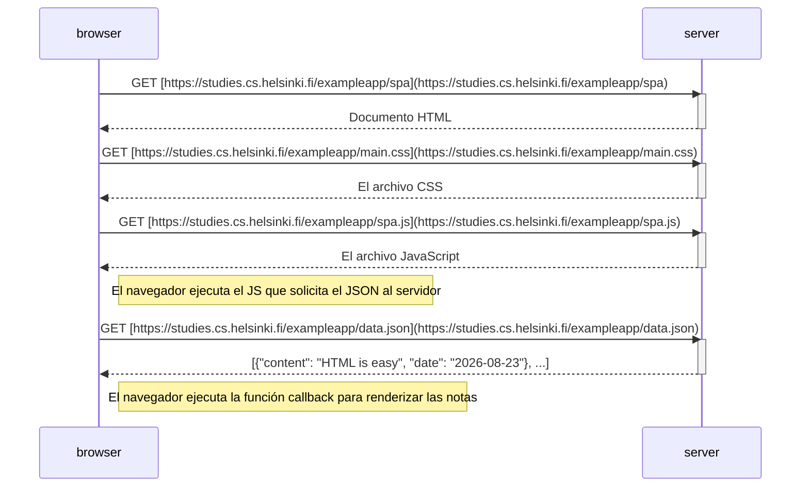
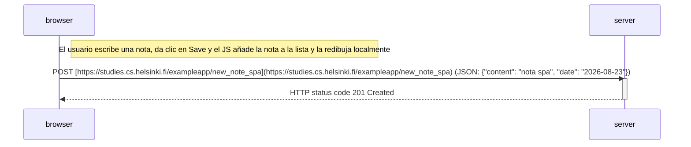

## Ejercicio 0.4: Nuevo diagrama de nota

```mermaid
sequenceDiagram
    participant browser
    participant server

    Note right of browser: El usuario escribe una nota y hace clic en "Save"

    browser->>server: POST [https://studies.cs.helsinki.fi/exampleapp/new_note](https://studies.cs.helsinki.fi/exampleapp/new_note)
    activate server
    Note over server: El servidor guarda la nueva nota en el arreglo de notas
    server-->>browser: HTTP status code 302 (URL redirect to /notes)
    deactivate server

    browser->>server: GET [https://studies.cs.helsinki.fi/exampleapp/notes](https://studies.cs.helsinki.fi/exampleapp/notes)
    activate server
    server-->>browser: Documento HTML
    deactivate server

    browser->>server: GET [https://studies.cs.helsinki.fi/exampleapp/main.css](https://studies.cs.helsinki.fi/exampleapp/main.css)
    activate server
    server-->>browser: El archivo CSS
    deactivate server

    browser->>server: GET [https://studies.cs.helsinki.fi/exampleapp/main.js](https://studies.cs.helsinki.fi/exampleapp/main.js)
    activate server
    server-->>browser: El archivo JavaScript
    deactivate server

    Note right of browser: El navegador ejecuta el JS que solicita el JSON al servidor

    browser->>server: GET [https://studies.cs.helsinki.fi/exampleapp/data.json](https://studies.cs.helsinki.fi/exampleapp/data.json)
    activate server
    server-->>browser: [{"content": "nueva nota", "date": "2026-08-23"}, ...]
    deactivate server

    Note right of browser: El navegador ejecuta la función callback para renderizar las notas
```

## Ejercicio 0.5: Diagrama de aplicación de una sola página (SPA)

```mermaid
sequenceDiagram
    participant browser
    participant server

    browser->>server: GET [https://studies.cs.helsinki.fi/exampleapp/spa](https://studies.cs.helsinki.fi/exampleapp/spa)
    activate server
    server-->>browser: Documento HTML
    deactivate server

    browser->>server: GET [https://studies.cs.helsinki.fi/exampleapp/main.css](https://studies.cs.helsinki.fi/exampleapp/main.css)
    activate server
    server-->>browser: El archivo CSS
    deactivate server

    browser->>server: GET [https://studies.cs.helsinki.fi/exampleapp/spa.js](https://studies.cs.helsinki.fi/exampleapp/spa.js)
    activate server
    server-->>browser: El archivo JavaScript
    deactivate server

    Note right of browser: El navegador ejecuta el JS que solicita el JSON al servidor

    browser->>server: GET [https://studies.cs.helsinki.fi/exampleapp/data.json](https://studies.cs.helsinki.fi/exampleapp/data.json)
    activate server
    server-->>browser: [{"content": "HTML is easy", "date": "2026-08-23"}, ...]
    deactivate server

    Note right of browser: El navegador ejecuta la función callback para renderizar las notas
```

## Ejercicio 0.6: Nueva nota en diagrama de aplicación de una sola página

```mermaid
sequenceDiagram
    participant browser
    participant server

    Note right of browser: El usuario escribe una nota, da clic en Save y el JS añade la nota a la lista y la redibuja localmente

    browser->>server: POST [https://studies.cs.helsinki.fi/exampleapp/new_note_spa](https://studies.cs.helsinki.fi/exampleapp/new_note_spa) (JSON: {"content": "nota spa", "date": "2026-08-23"})
    activate server
    server-->>browser: HTTP status code 201 Created
    deactivate server
```